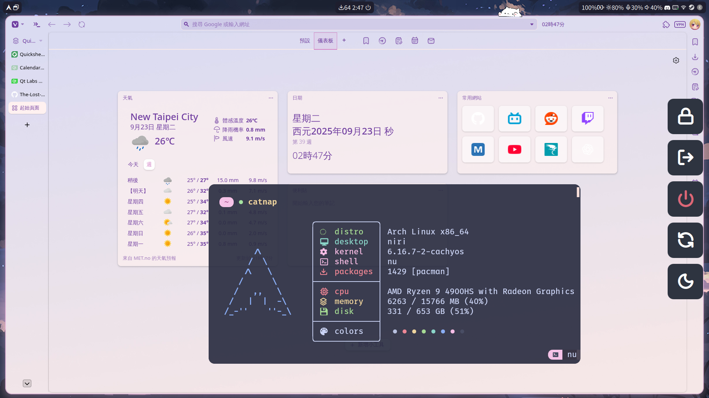

> [!WARNING]
> Because I am preparing for the exam, and the ags would have breaking change one day.
> So my dotfiles there will be no major changes in the near future.

# TODO
- [ ] migrate from wttr to open-meteo
## ags
- [ ] corner mask
- [ ] config.json with async
- [ ] Overvies OSD
- [ ] notification system to replace swaync
- [ ] system tweak(e.g. volume) osd
- [ ] system information
- [ ] arch update use tte to add animation

# Themes
|Type  |Package        |
|------|---------------|
|Widget|Orchis theme   |
|Icon  |Tela Icon Theme|
|Cursor|Bibata Cursor  |

# Fonts
|Type           |Package           |
|---------------|------------------|
|Chinese        |Noto Sans CJK (TC)|
|Monospaced Font|FiraCode Nerd Font|

# Dependences
Refer to .config/aconfmgr
|Type           |Package|Remark           |
|--------------|--------|-----------------|
|Window manager|hyprland|Plugin: Hyprspace|
|Widget        |ags     |
|Lockscreen    |hyprlock|
|Idle          |hypridle|
|Boot manager  |refind  |
|Maintain      |aconfmgr|

# Issue
## Fixing
https://github.com/Aylur/ags/pull/454
https://github.com/Aylur/ags/issues/392
https://github.com/Aylur/ags/pull/496
## Wait for Fixed
https://github.com/Aylur/ags/pull/397
https://github.com/Aylur/ags/issues/450
Hyproverview close with wrong padding when layer hide
