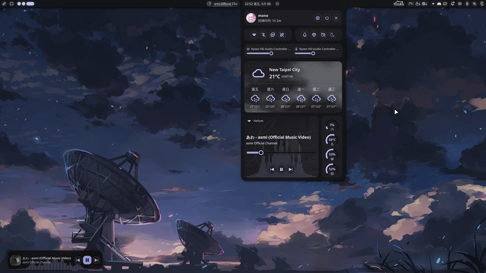

# Themes
|Type  |Package          |
|------|-----------------|
|GTK   |Adwaita(adw-gtk3)|
|QT    |Colloid          |
|Icon  |Tela Icon Theme  |
|Cursor|Bibata Cursor    |

## Fonts
|Type           |Package           |
|---------------|------------------|
|Chinese        |Noto Sans CJK (TC)|
|Monospaced Font|Maple Mono NF CN  FiraCode Nerd Font|

# [Dependences](.config/aconfmgr/README.md)
|Type          |Package   |
|--------------|----------|
|Window manager|Niri      |
|Shell         |Noctalia  |
|Boot manager  |Refind    |
|Maintain      |Aconfmgr  |
